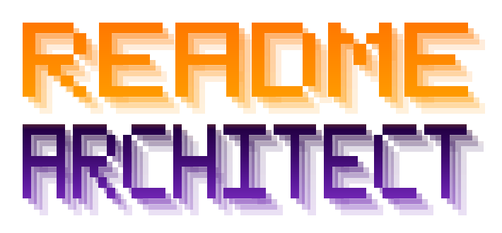
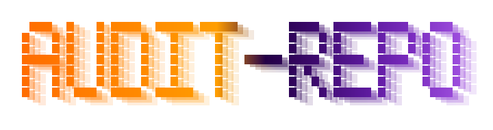
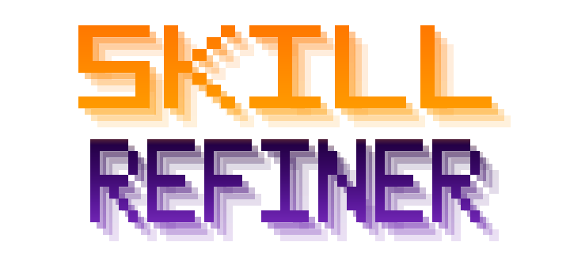

# Acrazie Skills

[](https://skills.sh/Acrazie/skills)

Focused skills for AI coding agents. Each skill owns one concrete workflow and keeps its instructions, UI metadata, and supporting references together.

## Install

Browse and select skills interactively:

```bash
npx skills add Acrazie/skills
```

Install one skill directly:

```bash
npx skills add Acrazie/skills@repository-readme-architect-acrazie
npx skills add Acrazie/skills@audit-repository-acrazie
npx skills add Acrazie/skills@svg-icon-designer-acrazie
npx skills add Acrazie/skills@skill-refiner-acrazie
npx skills add Acrazie/skills@jenkins-devops-acrazie
```

The CLI detects supported coding agents and lets you choose where to install each skill.

## Skills

### [Repository README Architect / Acrazie](skills/repository-readme-architect-acrazie/SKILL.md)

<p align="center">
  
</p>

Design, create, restructure, or update a repository's primary README through repository inspection, an adaptive decision-tree interview, architecture options, and an approval-gated edit.

```text
$repository-readme-architect-acrazie
```

### [Audit Repository / Acrazie](skills/audit-repository-acrazie/SKILL.md)

<p align="center">
  
</p>

Audit a precise technical decision, integration, tool, stack choice, or subsystem in one existing repository. This skill requires explicit invocation and does not perform general, security, documentation, diff, PR, or multi-repository audits.

```text
$audit-repository-acrazie
```

### [SVG Icon Designer / Acrazie](skills/svg-icon-designer-acrazie/SKILL.md)

<p align="center">
  
</p>

Design original icons through compact iterative concepts, detailed ASCII previews, selected-direction refinement, clean SVG production, and requested PNG or favicon exports.

```text
$svg-icon-designer-acrazie
```

### [Skill Refiner / Acrazie](skills/skill-refiner-acrazie/SKILL.md)

<p align="center">
  
</p>

Collect structured feedback while testing one target skill, preserve observations in an append-only journal, and consolidate approved behavioral decisions into a living ADR without editing the target skill.

```text
$skill-refiner-acrazie
```

### [Jenkins DevOps / Acrazie](skills/jenkins-devops-acrazie/SKILL.md)

Design, modernize, and diagnose repository-owned Jenkins CI/CD pipelines through evidence-first inspection, an approval-gated ADR, immutable artifact promotion, deployment safeguards, and explicit validation limits.

```text
$jenkins-devops-acrazie
```

## Naming

Published skill IDs keep the function first for discovery and use `-acrazie` as a consistent author signature. The canonical source is `Acrazie/skills`.

## Repository Structure

```text
skills/
├── repository-readme-architect-acrazie/
├── audit-repository-acrazie/
├── svg-icon-designer-acrazie/
├── skill-refiner-acrazie/
└── jenkins-devops-acrazie/
```

Each directory contains its `SKILL.md`, `agents/openai.yaml`, and only the references required by that workflow.

## Migrated Repositories

This monorepo supersedes the standalone `Acrazie/readme-architect` and `Acrazie/audit-repo` repositories.

## License

[MIT](LICENSE)
