# Idéation de Skills — Runtimes, Systèmes & Outillage (Articles Bun)

## 1. Origine & Démarche

Ce document consigne l'idéation formelle de nouvelles compétences spécialisées pour le monorepo Acrazie, issue de l'analyse des articles d'ingénierie et retours d'expérience du blog officiel de Bun ([`https://bun.com/blog`](https://bun.com/blog)).

Cette étape fait suite à la première phase d'idéation menée sur l'article fondateur de Jarred Sumner (*Rewriting Bun in Rust*), qui avait abouti à la création de trois skills majeurs du catalogue :
1. `test-retrofitter-acrazie` : rétrofit de suites de tests unitaires et de caractérisation sur du code legacy ou non testé.
2. `product-critic-acrazie` : critique produit et rationalisation d'usages pour éviter la sur-ingénierie et les modernisations spéculatives.
3. `adversarial-reviewer-acrazie` : revue de code contradictoire en contexte cognitif scindé, traquant les dérives sémantiques (*Semantic Drift*) et les pièges mémoire/concurrence avec obligation de *Proof of Flaw*.

L'exploration des autres articles de fond s'est appuyée sur le skill [`multi-agent-planner-acrazie`](file:///Users/acrazie/Documents/ProjectPerso/skills/skills/multi-agent-planner-acrazie/SKILL.md) avec un modèle *Fan-out / Fan-in* derrière une spécification centrale, orchestrant trois agents spécialisés en parallèle.

---

## 2. Cartographie des Articles & Grappes d'Ingénierie

Parmi les 178 publications du blog, les notes de patchs mineures ont été écartées au profit de huit articles d'ingénierie système fondamentaux, répartis en trois domaines :

```mermaid
flowchart TD
    Blog["Bun Blog Engineering Deep-Dives"] --> G1["Domaine 1 : Systèmes, Mémoire & Crash"]
    Blog --> G2["Domaine 2 : Outils, Dépendances & Shell"]
    Blog --> G3["Domaine 3 : Runtimes, ABI & Métaprogrammation"]

    G1 --> A1["Debugging JavaScript Memory Leaks"]
    G1 --> A2["bun.report crash reporter"]
    G1 --> A3["500x faster postMessage(string)"]

    G2 --> B1["Behind The Scenes of Bun Install"]
    G2 --> B2["The Bun Shell"]
    G2 --> B3["Text-based lockfile (bun.lock)"]

    G3 --> C1["How Bun supports V8 APIs without V8"]
    G3 --> C2["Compile and run C in JavaScript (bun:ffi)"]
    G3 --> C3["JavaScript Macros in Bun"]

    G1 --> S1["memory-leak-diagnostician-acrazie"]
    G1 --> S2["crash-trace-triager-acrazie"]
    G2 --> S3["lockfile-reconciler-acrazie"]
    G2 --> S4["script-portability-acrazie"]
    G3 --> S5["native-ffi-bridge-acrazie"]
    G3 --> S6["build-macro-optimizer-acrazie"]
```

---

## 3. Fiches Détaillées des Propositions de Skills

### Proposition 1 : `memory-leak-diagnostician-acrazie`

* **Source d'inspiration :** *Debugging JavaScript Memory Leaks* & *500x faster postMessage(string)*.
* **Problème d'ingénierie résolu :** Saturation progressive de la mémoire vive (RSS) et crashs OOM en production causés par des rétentions invisibles dans le graphe d'objets du ramasse-miettes (scopes lexicaux captifs dans les closures, listeners `AbortSignal`/`EventEmitter` non désinscrits, accumulation de Promesses non résolues, ou clonage superflu de buffers de flux réseau).
* **Workflow concret déclencheur :**
  1. *Déclenchement :* Invoqué lorsqu'un service Node/Bun ou une suite de tests subit une fuite mémoire progressive, avec des exports de heap (`.heapsnapshot`), des séries temporelles de métriques (`heapStats()`, `process.memoryUsage()`) ou un script de reproduction sous charge (`repro.ts`).
  2. *Analyse différentielle :* Calcul des deltas d'allocation (*Retained Size* et *Instance Count*) entre deux points de capture.
  3. *Arbre de rétention (*Retainer Graph*) :* Reconstitution du chemin de référence depuis les racines GC (objets protégés, variables globales, listeners système) jusqu'aux cibles fuyantes.
  4. *Remédiation chirurgicale :* Proposition d'un patch décorrélant la closure, instanciant un `Blob` plutôt qu'un clonage de buffer, ou nettoyant systématiquement les listeners d'événements.
* **Contrat d'entrée et de sortie vérifiable :**
  - *Entrée :* Deux snapshots mémoire `.heapsnapshot` OU logs de séries de consommation mémoire + accès aux sources suspectées.
  - *Sortie :* `memory-leak-report.md` avec matrice des deltas, graphe Mermaid du Retainer Path, cause racine catégorisée et patch de code unifié garantissant la dé-rétention.
* **Frontières d'exclusion :**
  - Distinct d'`adversarial-reviewer-acrazie` : n'effectue pas une revue générale de PR, mais résout un incident de graphe mémoire basé sur des métriques d'exécution.
  - Distinct de `test-retrofitter-acrazie` : ne produit qu'une assertion ciblée de stabilité RSS/Heap, sans rédiger de tests fonctionnels unitaires métier.
  - Distinct d'`audit-repository-acrazie` : ne fait pas d'évaluation de santé de dépôt globale.

---

### Proposition 2 : `crash-trace-triager-acrazie`

* **Source d'inspiration :** *bun.report is Bun's new crash reporter*.
* **Problème d'ingénierie résolu :** Triage et résolution de crashes natifs (SIGSEGV, panics, assertions rompues en Zig/C++/Rust) survenant en production sur des binaires sans symboles de débogage embarqués, où l'ASLR (Address Space Layout Randomization) rend les adresses de stack aléatoires et où les core dumps complets sont prohibés pour des raisons de confidentialité (PII/secrets).
* **Workflow concret déclencheur :**
  1. *Déclenchement :* Invoqué sur réception d'un rapport de crash binaire, d'une trace d'adresses hexadécimales brutes (`0x7ff... in ???`), d'un token compressé VLQ (type `bun.report`) ou d'une sortie de panique native en CI.
  2. *Dérandomisation ASLR :* Calcul des adresses relatives à la base du module binaire selon l'OS (PE sous Windows via `GetModuleHandleExW`, ELF sous Linux via `dl_iterate_phdr`, Mach-O sous macOS via `_dyld_image_count`).
  3. *Symbolisation ciblée :* Résolution des fonctions dé-manglées, fichiers sources et numéros de lignes via `llvm-symbolizer` ou `addr2line` à partir du commit Git SHA exact du binaire.
  4. *Sanitisation Zéro-PII :* Élimination stricte des chemins de fichiers locaux utilisateur, des arguments de ligne de commande et des variables d'environnement.
* **Contrat d'entrée et de sortie vérifiable :**
  - *Entrée :* Trace de crash brute (stderr / token URL), commit Git SHA du binaire, sources du projet au commit.
  - *Sortie :* `crash-triage-report.md` avec stack trace complète symbolisée, identification de l'instruction ou de l'assertion défaillante, et ticket d'incident sanitisé prêt pour GitHub Issues.
* **Frontières d'exclusion :**
  - Distinct de `jenkins-devops-acrazie` : n'administre pas les pipelines CI/CD ; traite les artefacts de crash binaire émis lors des jobs de test.
  - Distinct de `memory-leak-diagnostician-acrazie` : opère sur l'arrêt brutal (crash/panic/segfault) et les adresses ASLR natives, non sur l'allocation progressive du GC.

---

### Proposition 3 : `lockfile-reconciler-acrazie`

* **Source d'inspiration :** *Behind The Scenes of Bun Install* & *Bun's new text-based lockfile (bun.lock)*.
* **Problème d'ingénierie résolu :** Conflits de fusion Git insolubles sur les lockfiles (`bun.lock`, `package-lock.json`, `pnpm-lock.yaml`, `yarn.lock`) et divergence manifeste/lockfile en CI sous `--frozen-lockfile`. La mauvaise pratique habituelle consiste à détruire le lockfile et relancer `install`, ce qui provoque des mises à jour transitives incontrôlées et des régressions fantômes.
* **Workflow concret déclencheur :**
  1. *Déclenchement :* Présence de marqueurs de conflit Git (`<<<<<<<`) dans un lockfile lors d'un rebase/merge, ou échec d'un build CI en mode strict (`--frozen-lockfile` / `npm ci`).
  2. *Analyse différentielle 3-Way :* Comparaison des branches source, cible et base commune pour isoler l'intention réelle de chaque branche (quels paquets ont été délibérément ajoutés/mis à jour).
  3. *Re-synthèse de l'AST du lockfile :* Réconciliation déterministe des résolutions semver et des sommes de contrôle d'intégrité, sans altérer les sous-arbres transitifs non concernés.
  4. *Validation en environnement isolé :* Exécution d'un `install --frozen-lockfile` vérificateur (code de sortie 0).
* **Contrat d'entrée et de sortie vérifiable :**
  - *Entrée :* Lockfile avec marqueurs de conflit (ou branches Git en conflit) + `package.json`.
  - *Sortie :* Lockfile réconcilié et valide, preuve d'installation réussie avec `--frozen-lockfile` (code 0), et rapport d'arbitrage détaillant les versions retenues sans bump fantôme.
* **Frontières d'exclusion :**
  - Distinct d'`audit-repository-acrazie` : l'audit est read-only et oriente le choix de dépendances. Le reconciler est un outil de réparation et de convergence de build.
  - Distinct de `repo-modernizer-acrazie` : ne monte aucune version majeure de package ; restaure l'intégrité à périmètre fonctionnel constant.
  - Distinct de `git-ship-acrazie` : intervient comme sous-spécialiste technique lorsque `git-ship` bute sur un blocage de merge de lockfile.

---

### Proposition 4 : `script-portability-acrazie`

* **Source d'inspiration :** *The Bun Shell* & *Behind The Scenes of Bun Install*.
* **Problème d'ingénierie résolu :** Fragilité des scripts d'automatisation (`package.json` et shell) développés sous macOS/Linux lorsqu'ils s'exécutent sous Windows ou sur des conteneurs CI allégés, prolifération de micro-dépendances polyfills de scripts (`cross-env`, `rimraf`, `shx`, `which`), et risques d'injection de commandes par interpolation shell non échappée.
* **Workflow concret déclencheur :**
  1. *Déclenchement :* Audit ou demande de portabilité multiplateforme (Linux/macOS/Windows) des scripts du projet, ou échec de build sur un runner Windows.
  2. *Parsing AST des commandes :* Détection des syntaxes non portables (séparateurs de chemins, variables en préfixe `VAR=val`, commandes Unix `rm -rf`, `mkdir -p`).
  3. *Refactorisation ciblée :*
     - *Mode Runtime neutre :* Standardisation sur les commandes internes Node.js (`node --run`, `fs.rmSync`).
     - *Mode Runtime Bun :* Migration vers le Bun Shell (`$`) natif sans sous-processus shell externe ni polyfills.
  4. *Assainissement de la supply-chain :* Désinstallation des paquets `cross-env`, `rimraf`, etc., devenus superflus, réduisant les temps d'installation et les appels système.
* **Contrat d'entrée et de sortie vérifiable :**
  - *Entrée :* Section `scripts` de `package.json`, scripts d'outillage (`scripts/*`), matrice d'OS visée.
  - *Sortie :* Scripts refactorisés et portables, `package.json` allégé de ses polyfills, et preuve d'exécution réussie en dry-run multiplateforme.
* **Frontières d'exclusion :**
  - Distinct de `repo-modernizer-acrazie` : se focalise chirurgicalement sur la syntaxe et la portabilité des commandes de scripts, non sur la modernisation globale des linters/bundlers.
  - Distinct des spécialistes CI `jenkins-*-acrazie` : opère sur les commandes internes du dépôt, pas sur l'infrastructure Jenkinsfile.

---

### Proposition 5 : `native-ffi-bridge-acrazie`

* **Source d'inspiration :** *Compile and run C in JavaScript (`bun:ffi` + TinyCC)* & *How Bun supports V8 APIs without using V8*.
* **Problème d'ingénierie résolu :** Consommer des bibliothèques C systèmes ou dynamiques natives (`.dylib`, `.so`, `.dll`, frameworks OS) sans la lourdeur et les cassures de compilation en CI imposées par `node-gyp`/N-API, ni les limitations de WebAssembly (isolation mémoire 32-bit et absence d'appels système). Prévenir en même temps les pièges des pointeurs bruts en JavaScript (segfaults, fuites manuelles, désalignements de structures).
* **Workflow concret déclencheur :**
  1. *Déclenchement :* Le développeur souhaite appeler une bibliothèque C système (Keychain macOS, compression zstd/libdeflate, multimédia, ioctls) ou remplacer un vieux module natif C++ compilé par un pont FFI in-process moderne.
  2. *Génération de la colle C :* Rédaction d'une micro-couche `glue.c` (compilable instantanément par TinyCC ou Clang) masquant la complexité des pointeurs et exposant des scalaires simples.
  3. *Bridge TypeScript typé :* Déclaration des symboles FFI (`cstring`, `ptr`, `i32`) et encapsulation dans des interfaces sécurisées.
  4. *Gestion de cycle de vie RAII :* Implémentation du pattern `Symbol.dispose` / `using` ou `FinalizationRegistry` pour garantir la libération systématique des buffers natifs alloués.
* **Contrat d'entrée et de sortie vérifiable :**
  - *Entrée :* En-têtes C (`.h`), bibliothèque partagée cible, signatures requises.
  - *Sortie :* `glue.c` minimal, `bridge.ts` typé, harnais RAII de libération mémoire, et benchmark d'overhead (latence en ns/appel) avec test d'intégrité sans segfault.
* **Frontières d'exclusion :**
  - Distinct de `feature-builder-acrazie` : ne conçoit pas de logique métier applicative ; façonne le pont d'interopérabilité natif bas niveau.
  - Distinct de `test-retrofitter-acrazie` : fournit uniquement le harnais de validation de mémoire FFI et d'ABI.

---

### Proposition 6 : `build-macro-optimizer-acrazie`

* **Source d'inspiration :** *JavaScript Macros in Bun (bun-macros)*.
* **Problème d'ingénierie résolu :** Surcoût au démarrage et gonflement des bundles causés par l'exécution au runtime de calculs prévisibles à la compilation : validation et parsing statiques de gros schémas (Zod, JSON Schema, CSV), embedding de métadonnées (commit SHA, dates, versions), tables de hachage pré-calculées, ou branches de feature flags mortes. Les solutions usuelles (scripts de pré-build générant des fichiers `*.generated.ts`) polluent les dépôts et désynchronisent la CI.
* **Workflow concret déclencheur :**
  1. *Déclenchement :* Volonté d'optimiser le cold-start d'un serveur ou le poids d'un bundle client en déportant des calculs purs et déterministes au moment du bundling.
  2. *Transformation en Macros :* Extraction des fonctions pures dans des fichiers `*.macro.ts` respectant les contraintes d'évaluation au build-time (arguments statiquement analysables, retours sérialisables en AST : littéraux, JSON, TypedArray base64).
  3. *Inlining dans l'AST & Dead-Code Elimination (DCE) :* Remplacement des sites d'appel par les valeurs littérales calculées et vérification que les branches inaccessibles sont éliminées du bundle final.
  4. *Barrière de sécurité :* Vérification de l'absence de macro dans les dépendances tierces (`node_modules`) et mise en place d'un repli si les macros sont désactivées.
* **Contrat d'entrée et de sortie vérifiable :**
  - *Entrée :* Modules sources contenant les calculs ou schémas statiques coûteux + configuration du bundler.
  - *Sortie :* Fichiers `*.macro.ts`, code consommateur refactorisé, et preuve différentielle sur le bundle compilé démontrant la réduction de taille et l'élision physique du code mort.
* **Frontières d'exclusion :**
  - Distinct de `repo-modernizer-acrazie` : ne migre pas les versions de bundlers ; refactorise la logique interne en macros d'AST.
  - Distinct de `product-critic-acrazie` : n'évalue pas la pertinence fonctionnelle des fonctionnalités ; optimise l'empreinte d'exécution technique.

---

## 4. Matrice de Non-Recouvrement & Respect des Invariants

| Nouveau Skill Proposé | Domaine Technique | Entrée / Artefact Clé | Sortie Vérifiable | Compétences Voisines Exclues |
| :--- | :--- | :--- | :--- | :--- |
| **`memory-leak-diagnostician-acrazie`** | Mémoire & GC | `.heapsnapshot`, `heapStats()` | Retainer Tree + Patch dé-rétention | `adversarial-reviewer` (revue diff), `audit-repository` |
| **`crash-trace-triager-acrazie`** | Systèmes & Crash natif | Trace hex / Stderr / VLQ token | Trace dé-manglée + Rapport Zéro-PII | `jenkins-devops` (CI), `adversarial-reviewer` |
| **`lockfile-reconciler-acrazie`** | Dépendances & Git merge | Lockfile en conflit / CI frozen | Lockfile réparé + Sortie code 0 | `audit-repository` (read-only), `repo-modernizer` |
| **`script-portability-acrazie`** | Shell & Outillage build | `package.json` scripts, sh/cmd | Scripts multi-OS + Purge polyfills | `repo-modernizer` (macro-toolchain), Jenkins skills |
| **`native-ffi-bridge-acrazie`** | FFI, ABI & Interop C/JS | Headers C, `.so`/`.dylib` | `glue.c` + `bridge.ts` + RAII | `feature-builder` (métier), `repo-modernizer` |
| **`build-macro-optimizer-acrazie`** | Métaprogrammation AST | Fonctions statiques, schémas | `*.macro.ts` + Bundle élidé (DCE) | `product-critic` (UX/usages), `repo-modernizer` |

---

## 5. Recommandation Stratégique de Priorisation

Si l'on évalue l'impact opérationnel immédiat pour les développeurs et agents de code travaillant sur des dépôts modernes, voici l'ordre de priorité suggéré :

1. **Top 1 : `lockfile-reconciler-acrazie` (Friction maximale en équipe & en agentique)**
   - *Pourquoi :* Les agents IA et développeurs se heurtent en permanence à des conflits de lockfiles lors de fusions de PR ou rebases. L'action destructive habituelle (`rm lockfile && install`) introduit des instabilités critiques. Avoir un spécialiste dédié de la réconciliation déterministe résout un blocage quotidien.
2. **Top 2 : `memory-leak-diagnostician-acrazie` (Diagnostic d'infrastructure critique)**
   - *Pourquoi :* Les fuites mémoire en JavaScript/TypeScript (closures captives, listeners zombies) sont parmi les anomalies les plus complexes à déboguer en environnement conteneurisé. Automatiser l'analyse différentielle de snapshots et l'arbre de rétention apporte une valeur d'expertise rare.
3. **Top 3 : `script-portability-acrazie` (Hygiène d'outillage & Supply-chain)**
   - *Pourquoi :* Facile à déployer, apporte un assainissement immédiat des dépôts en supprimant des dizaines de dépendances polyfills désuètes et en garantissant que les scripts tournent sans surprise sur Linux, macOS et Windows.
4. **Second lot :** `crash-trace-triager-acrazie`, `native-ffi-bridge-acrazie` et `build-macro-optimizer-acrazie`, destinés à des contextes plus spécialisés (systèmes natifs compilés, FFI et optimisations poussées de bundler).
