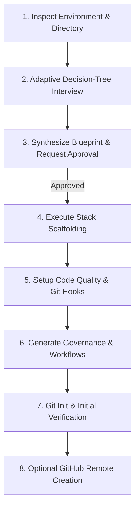

# GitHub Repo Init / Acrazie

Scaffold and bootstrap a complete, production-grade GitHub repository tailored to explicit user requirements. Every repository must start with a clean architecture, robust governance, automated quality gates, and maintainable configuration.

---

## 1. Scope & Invariants

1. **Explicit Invariants**:
   - **No Silent Assumptions**: Never choose a stack, package manager, linter, or repository visibility without asking or obtaining approval.
   - **Approval Gate**: Present a consolidated **Repository Blueprint** and obtain explicit user confirmation before creating files or running mutating shell commands.
   - **Tooling Verification**: Verify CLI availability (`node`, `pnpm`, `uv`, `go`, `cargo`, `git`, `gh`) before executing commands. If a tool is missing, report the dependency and offer alternatives.
   - **Git Hygiene**: Always configure `.gitignore` *before* package installations so caches and dependencies (e.g. `node_modules`, `.venv`) are never tracked.
   - **Conventional Commits**: Format the initial commit using Conventional Commits (`chore: initial repository bootstrap`). Never add co-author attributions.
   - **Non-Destructive Execution**: Never overwrite an existing populated directory without explicit user authorization.

---

## 2. Workflow Overview



---

## 3. Workflow Steps

### Step 1: Inspect Environment & Directory
Before asking questions, inspect the current environment:
- Check current working directory path and check whether it contains existing files (`ls -la`).
- Check if git is already initialized (`git status`).
- Check installed CLI tooling availability (`node -v`, `pnpm -v`, `uv --version`, `go version`, `cargo --version`, `gh auth status`).
- Record findings as baseline facts so you do not ask the user for facts the environment already answers.

---

### Step 2: Adaptive Decision-Tree Interview
Read [references/interview-tree.md](references/interview-tree.md) before conducting the interview.

Follow an adaptive decision tree grouped into themes:
1. **Repository Identity & Destination**:
   - Repository name, description, target directory (`.` vs `./<repo-name>`).
   - Remote repository: Local only vs GitHub remote (Public or Private).
2. **Stack & Framework**:
   - JS/TS (React Vite, Vue Vite, Next.js, Node CLI/tsup), Python (`uv` / Poetry, FastAPI / CLI), Go, Rust, or Custom / Agnostic.
   - Preferred package manager (`pnpm`, `npm`, `uv`, etc.).
3. **Code Quality & Git Hooks**:
   - Hook manager: **Lefthook** (recommended), Husky, pre-commit, or None.
   - Linter/Formatter: **Biome** (recommended for JS/TS), ESLint + Prettier, **Ruff** (Python), golangci-lint, clippy.
   - Commit linting: Conventional Commits via commit-msg hook.
4. **CI/CD Workflows**:
   - Automated CI testing/linting/build (`ci.yml`).
   - Automated releases: **Release Please** (recommended), Changesets, or manual.
   - Dependabot / Security audit.
5. **Governance & Documentation**:
   - `README.md`, `SECURITY.md`, `CONTRIBUTING.md`, `LICENSE` (MIT by default).
   - `.github/ISSUE_TEMPLATE/` (bug & feature), `PULL_REQUEST_TEMPLATE.md`, `CODEOWNERS`.
   - `.editorconfig`, `.gitignore`.

*Note*: If the user provides requirements upfront in their prompt, mark those decisions as settled and only ask about unresolved branches.

---

### Step 3: Synthesize Blueprint & Approval Gate
Synthesize all answers into a clear, structured **Repository Blueprint**:
- Summary of target directory, stack, package manager, quality tools, CI/CD actions, and governance files.
- Visual directory tree preview showing the expected repository structure.
- **Approval Gate**: Stop and ask:
  > "Here is the proposed blueprint for `<repo-name>`. Please review and confirm to start scaffolding, or let me know if you want to tweak any option."

Do **NOT** write files or run mutating commands before receiving user confirmation.

---

### Step 4: Execute Scaffolding
Read [references/stack-recipes.md](references/stack-recipes.md) for precise commands.
1. Create and enter target directory if not working in `.`.
2. Generate curated `.gitignore` and `.editorconfig` first.
3. Run the official initialization command for the chosen stack (e.g. `pnpm create vite . --template react-ts`, `uv init`, `cargo init`, `go mod init`).
4. Verify the generated skeleton compiles or installs cleanly.

---

### Step 5: Code Quality & Git Hooks Setup
Read [references/tooling-recipes.md](references/tooling-recipes.md).
1. Install chosen linter/formatter (e.g. `@biomejs/biome` or `ruff`).
2. Generate configuration file (e.g. `biome.json` or `pyproject.toml` tool sections).
3. If Git hooks are selected, install the hook manager (e.g. `lefthook`), write `lefthook.yml`, and configure `commitlint` if requested.

---

### Step 6: Generate Governance & Workflows
Read [references/governance-templates.md](references/governance-templates.md) and [references/github-workflows.md](references/github-workflows.md).
1. Create `.github/workflows/ci.yml` adapted to the chosen stack.
2. If release automation was requested, add `.github/workflows/release-please.yml` and `release-please-config.json`.
3. If Dependabot was selected, add `.github/dependabot.yml`.
4. Generate `.github/ISSUE_TEMPLATE/bug_report.yml` and `feature_request.yml`.
5. Generate `.github/PULL_REQUEST_TEMPLATE.md`.
6. Write authoritative documentation:
   - `README.md`: Project title, badges, description, prerequisites, quickstart, available commands, architecture overview.
   - `SECURITY.md`: Vulnerability reporting process and supported versions table.
   - `CONTRIBUTING.md`: Workflow, branching model, commit conventions, local test steps.
   - `LICENSE`: Full legal text of the chosen license with current year and author.
   - `CODEOWNERS` (if requested).

---

### Step 7: Git Init & Verification
1. If not already a git repository:
   ```bash
   git init -b main
   ```
2. Activate git hooks:
   ```bash
   npx lefthook install # or relevant hook install command
   ```
3. Run local validation:
   - Run the linter/formatter on all files (`pnpm biome check .` or `uv run ruff check`).
   - Run test suite if tests exist (`pnpm test` or `uv run pytest`).
   - Run build if build script exists (`pnpm build` or `cargo check`).
4. Stage all files and create the initial commit:
   ```bash
   git add .
   git commit -m "chore: initial repository bootstrap"
   ```
   *Rule: Never add co-author attributions.*

---

### Step 8: Optional GitHub Remote Creation
If the user requested remote GitHub creation and `gh` is authenticated:
1. Create the repository on GitHub:
   ```bash
   # For public repo:
   gh repo create <repo-name> --public --source=. --remote=origin --push

   # For private repo:
   gh repo create <repo-name> --private --source=. --remote=origin --push
   ```
2. Present the repository URL and clone URL to the user.

---

### Step 9: Completion Report
Provide a concise summary:
- Repository status: local path, git branch, remote URL (if created).
- Installed tools, configs, and workflows.
- Ready-to-use commands (`dev`, `lint`, `test`, `build`).
- Next steps for development.
