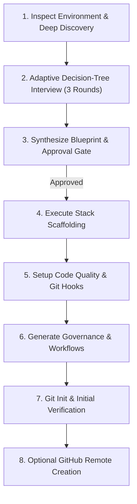

# GitHub Repo Init / Acrazie

Scaffold and bootstrap a complete, production-grade GitHub repository tailored to explicit user requirements. Every repository must start with a clean architecture, robust governance, automated quality gates, and maintainable configuration.

---

## 1. Scope & Invariants

1. **Explicit Invariants**:
   - **No Silent Assumptions**: Never choose a stack, package manager, linter, or repository visibility without asking or obtaining approval.
   - **Deep Prior Discovery**: If running in an existing populated directory or initialized git repository, thoroughly explore existing manifests, workflows, linters, and tests *before* asking questions, and prune all redundant questions from the interview.
   - **Approval Gate**: Present a consolidated **Repository Blueprint** and obtain explicit user confirmation before creating files or running mutating shell commands.
   - **Tooling Verification**: Verify CLI availability (`node`, `pnpm`, `uv`, `go`, `cargo`, `git`, `gh`) before executing commands. If a tool is missing, report the dependency and offer alternatives.
   - **Git Hygiene**: Always configure `.gitignore` *before* package installations so caches and dependencies (e.g. `node_modules`, `.venv`) are never tracked.
   - **Conventional Commits**: Format the initial commit using Conventional Commits (`chore: initial repository bootstrap`). Never add co-author attributions.
   - **Non-Destructive Execution**: Never overwrite an existing populated directory without explicit user authorization.

---

## 2. Workflow Overview



---

## 3. Workflow Steps

### Step 1: Inspect Environment & Directory (Deep Exploration)
Before asking questions, thoroughly inspect the working directory and system environment:
1. **Directory & Git State**:
   - Check current working directory path.
   - Check if git is initialized (`git status`), check existing remotes (`git remote -v`), and current branch.
   - Check whether the directory is empty or populated (`ls -la`).
2. **Deep Exploration of Existing Stack & Config (if directory is populated or git initialized)**:
   - **Language manifests**:
     - JS/TS: `package.json`, `tsconfig.json`, lockfiles (`pnpm-lock.yaml`, `package-lock.json`, `bun.lockb`).
     - Python: `pyproject.toml`, `requirements.txt`, `Pipfile`, `setup.py`, lockfiles (`uv.lock`, `poetry.lock`).
     - Go: `go.mod`, `go.sum`.
     - Rust: `Cargo.toml`, `Cargo.lock`.
   - **Code quality & tooling configurations**:
     - Linters/Formatters: `biome.json`, `.eslintrc*`, `ruff.toml`, `pyproject.toml` tool sections, `.golangci.yml`.
     - Git hooks: `lefthook.yml`, `.husky/`, `.pre-commit-config.yaml`.
   - **CI/CD & Workflows**:
     - `.github/workflows/` (inspect existing CI, release, and audit workflows).
     - Dependabot: `.github/dependabot.yml`.
   - **Existing Governance & DX**:
     - `README.md`, `LICENSE`, `CONTRIBUTING.md`, `SECURITY.md`.
     - `.editorconfig`, `.gitignore`, `.env*`, `scripts/`.
3. **CLI Tooling Availability**:
   - Check installed CLI tools (`node -v`, `pnpm -v`, `uv --version`, `go version`, `cargo --version`, `gh auth status`).
4. **Fact Consolidation & Pruning Invariant**:
   - Record all discovered facts (stack, package manager, remotes, existing linters/CI).
   - **Hard Invariant**: Never ask the user to choose or confirm a stack, framework, or package manager if authoritative manifests are already present. Treat discovered configuration as settled baseline and prune redundant questions from the interview.

---

### Step 2: Adaptive Decision-Tree Interview
Read [references/interview-tree.md](references/interview-tree.md) before conducting the interview.

Do **NOT** present all interview themes in a single monolithic questionnaire. Conduct an adaptive interview grouped into at most **2 to 3 progressive rounds**, where every question includes an explicit, contextual recommendation:

1. **Round 1: Identity, Destination & Stack**:
   - Target directory: in-place (`.`) vs new subfolder (`./<repo-name>`). *(Pruned if in-place execution is obvious or explicitly stated).*
   - Repository name & description. *(Pruned if manifest or directory name provides it).*
   - Remote GitHub repository: Local only vs GitHub remote (Public or Private) via `gh`. *(Pruned if remote `origin` already exists; ask only whether to keep or replace).*
   - Stack preset & package manager: *(Pruned if detected during Step 1; otherwise asked with recommended defaults).*
2. **Round 2: Quality Gates, CI/CD & Governance**:
   - Git hook manager: **Lefthook** (recommended), Husky, pre-commit, or None.
   - Linter/Formatter: **Biome** (recommended for JS/TS), **Ruff** (recommended for Python), golangci-lint, clippy. *(Pruned if already configured).*
   - Commit linting: Conventional Commits via commit-msg hook. *(Recommended: Yes).*
   - CI/CD workflows: Automated CI (`ci.yml`) and **Release Please** (recommended).
   - Governance files: Generate missing files (`README.md`, `SECURITY.md`, `CONTRIBUTING.md`, `LICENSE`, issue/PR templates). If existing files are detected, ask whether to preserve or overwrite.
3. **Round 3: Workflow, Worktrees & Developer Experience (DX)**:
   - Branching model: Trunk-based (`main`) with branch naming conventions (`feat/`, `fix/`, `chore/`). *(Recommended: Yes).*
   - Git Worktrees: Enable parallel development workflow with `.worktrees/` in `.gitignore` and `scripts/worktree.sh`. *(Recommended: Yes).*
   - Runtime pinning & onboarding: Runtime version file (`.node-version`, `.python-version`) and bootstrap script (`scripts/setup.sh`). *(Recommended: Yes).*

*Note*: If the user provides requirements upfront in their prompt, mark those decisions as settled and only ask about unresolved branches. Always provide a recommended default with a concise rationale for every question.

---

### Step 3: Synthesize Blueprint & Approval Gate
Synthesize all answers into a clear, structured **Repository Blueprint**:
- Summary of target directory, stack, package manager, quality tools, CI/CD actions, governance files, branching model, and worktree/DX setup.
- Visual directory tree preview showing the expected repository structure.
- **Approval Gate**: Stop and ask:
  > "Here is the proposed blueprint for `<repo-name>`. Please review and confirm to start scaffolding, or let me know if you want to tweak any option."

Do **NOT** write files or run mutating commands before receiving user confirmation.

---

### Step 4: Execute Scaffolding
Read [references/stack-recipes.md](references/stack-recipes.md) for precise commands.
1. Create and enter target directory if not working in `.`.
2. Generate curated `.gitignore` (including `.worktrees/` and `.env*`) and `.editorconfig` first.
3. Run the official initialization command for the chosen stack (e.g. `pnpm create vite . --template react-ts`, `uv init`, `cargo init`, `go mod init`).
4. Verify the generated skeleton compiles or installs cleanly.

---

### Step 5: Code Quality & Git Hooks Setup
Read [references/tooling-recipes.md](references/tooling-recipes.md).
1. Install chosen linter/formatter (e.g. `@biomejs/biome` or `ruff`).
2. Generate configuration file (e.g. `biome.json` or `pyproject.toml` tool sections).
3. If Git hooks are selected, install the hook manager (e.g. `lefthook`), write `lefthook.yml`, and configure `commitlint` if requested.

---

### Step 6: Generate Governance, DX & Workflows
Read [references/governance-templates.md](references/governance-templates.md), [references/tooling-recipes.md](references/tooling-recipes.md), and [references/github-workflows.md](references/github-workflows.md).
1. Create `.github/workflows/ci.yml` adapted to the chosen stack and branch triggers (`main`, `staging`, `develop`).
2. If release automation was requested, add `.github/workflows/release-please.yml` and `release-please-config.json`.
3. If Dependabot was selected, add `.github/dependabot.yml`.
4. Generate `.github/ISSUE_TEMPLATE/bug_report.yml` and `feature_request.yml`.
5. Generate `.github/PULL_REQUEST_TEMPLATE.md`.
6. Generate DX & Setup scripts:
   - Create `.env.example` (sanitized with dummy values).
   - Create runtime version file (`.node-version`, `.python-version`, or `.tool-versions`).
   - Create `scripts/setup.sh` (executable onboarding script).
   - If worktrees are enabled, create `scripts/worktree.sh` (executable worktree helper).
7. Write authoritative documentation:
   - `README.md`: Project title, badges, description, prerequisites, quickstart, available commands, architecture overview.
   - `SECURITY.md`: Vulnerability reporting process and supported versions table.
   - `docs/git-workflow.md`: Complete Git delivery rules, branching strategy, worktree isolation, commit standards (Conventional Commits, no co-authors), quality gates, and draft PR protocol.
   - `AGENTS.md`: Lightweight agent instructions entrypoint containing project overview and concise pointer to `docs/git-workflow.md`. Create relative symlink `CLAUDE.md -> AGENTS.md`.
   - `CONTRIBUTING.md`: Workflow, branching model & environments, branch naming conventions, worktrees guide, commit conventions, local test steps.
   - `LICENSE`: Full legal text of the chosen license with current year and author.
   - `CODEOWNERS` (if requested).

---

### Step 7: Git Init & Verification
1. If not already a git repository:
   ```bash
   git init -b main
   ```
2. Activate git hooks:
   ```bash
   npx lefthook install # or relevant hook install command
   ```
3. Run local validation:
   - Run the linter/formatter on all files (`pnpm biome check .` or `uv run ruff check`).
   - Run test suite if tests exist (`pnpm test` or `uv run pytest`).
   - Run build if build script exists (`pnpm build` or `cargo check`).
4. Stage all files and create the initial commit:
   ```bash
   git add .
   git commit -m "chore: initial repository bootstrap"
   ```
   *Rule: Never add co-author attributions.*

---

### Step 8: Optional GitHub Remote Creation
If the user requested remote GitHub creation and `gh` is authenticated:
1. Create the repository on GitHub:
   ```bash
   # For public repo:
   gh repo create <repo-name> --public --source=. --remote=origin --push

   # For private repo:
   gh repo create <repo-name> --private --source=. --remote=origin --push
   ```
2. Present the repository URL and clone URL to the user.

---

### Step 9: Completion Report
Provide a concise summary:
- Repository status: local path, git branch, remote URL (if created).
- Installed tools, configs, and workflows.
- Ready-to-use commands (`dev`, `lint`, `test`, `build`).
- Next steps for development.
