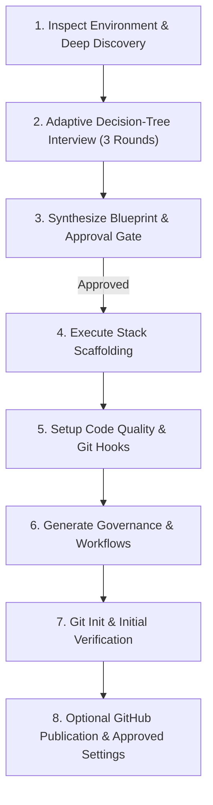

# GitHub Repo Init / Acrazie

Initialize repositories, activate project-local engineering kits, or administer explicitly targeted GitHub.com settings. Route to the requested mode before proposing changes; administration is not scaffolding.

## Choose the requested mode

- **GitHub administration**: inventory, recommend and manage repository settings or
  personal Developer Settings on GitHub.com, including existing resources and
  credential lifecycles. Read [github-administration.md](references/github-administration.md)
  instead of the scaffolding workflow. A local repository is not required for
  personal Developer Settings. Do not initialize a project, install a kit, change
  stack, build App code or perform Git delivery by implication.

- **Engineering activation**: configure and install a selected, versioned Acrazie
  skill kit inside an existing repository for Codex + Claude Code. Read
  [engineering-activation.md](references/engineering-activation.md) and follow
  that workflow instead of the scaffolding steps below. Preserve existing stack,
  tooling and governance; never create a remote, hooks or an initial commit by
  implication. Keep project activation separate from global contributor linking.
- **Repository initialization**: use the existing workflow below. Offer engineering
  activation only when requested or explicitly accepted; its installation has its
  own scoped approval. Do not silently add a skill bundle to a new repository.

In engineering mode, questions have only Current state, numbered Options,
Recommendation and Response, translated into the user's language. Explicit user
invocation confirms this skill only; each complementary skill still requires its
own activation. Selection or completion never authorizes Git delivery.

---

## 1. Scope & Invariants

Select this skill for requested initialization, engineering activation or GitHub administration. No named skill command is required. Inspect facts read-only within the requested scope; selection does not approve changes or expand the objective. For GitHub administration and remote settings in initialization, every mutation requires prior user approval of its exact action, target and proposed values, individually or in an explicitly enumerated bounded batch. Never infer approval from a recommendation, available credential or repository preauthorization. The engineering activation workflow retains its separately approved project action policy.

1. **Explicit Invariants**:
   - **No Silent Assumptions**: Never choose a stack, package manager, linter, or repository visibility without asking or obtaining approval.
   - **Deep Prior Discovery**: If running in an existing populated directory or initialized git repository, thoroughly explore existing manifests, workflows, linters, and tests *before* asking questions, and prune all redundant questions from the interview.
   - **Approval Gate**: Present a consolidated **Repository Blueprint** and obtain explicit user confirmation before creating files or running mutating shell commands.
   - **Tooling Verification**: Verify CLI availability (`node`, `pnpm`, `uv`, `go`, `cargo`, `git`, `gh`) before executing commands. If a tool is missing, report the dependency and offer alternatives.
   - **Current Option Discovery**: Before recommending any package, library, framework, package manager, hook manager, or CI/release tool, research current credible alternatives using official documentation and registry/release metadata. Templates are examples, not a closed catalog or automatic defaults. Preserve explicit user choices and established tooling; report material incompatibilities without silently replacing them. Read [references/tool-selection.md](references/tool-selection.md).
   - **Git/GitHub Capability Discovery**: Inspect the installed CLI help, current official API documentation, effective settings and access before proposing Git/GitHub configuration. Distinguish repository settings, caller authorization, and workflow token permissions; inaccessible is not disabled. Read [references/github-settings.md](references/github-settings.md).
   - **Git Hygiene**: Always configure `.gitignore` *before* package installations so caches and dependencies (e.g. `node_modules`, `.venv`) are never tracked.
   - **Git Policy Belongs to the Repository**: Discover applicable organization/repository rules and relevant available Git skills before proposing a workflow. Present conflicts with their sources and consequences; the user decides whether to preserve, adapt, or request a change to a rule. Until changed through an authorized workflow, obey applicable higher-priority instructions and enforced protections. Never edit an external skill or configuration without specific approval. Generated repository policy must work without invoking another skill.
   - **Commit Convention**: Follow the convention selected in the interview or already enforced by the repository. Never add co-author attributions.
   - **Non-Destructive Execution**: Never overwrite an existing populated directory without explicit user authorization.

---

## 2. Workflow Overview


```mermaid
flowchart TD
  A["1. Inspect Environment & Deep Discovery"] --> B["2. Adaptive Decision-Tree Interview (3 Rounds)"]
  B --> C["3. Synthesize Blueprint & Approval Gate"]
  C -->|Approved| D["4. Execute Stack Scaffolding"]
  D --> E["5. Setup Code Quality & Git Hooks"]
  E --> F["6. Generate Governance & Workflows"]
  F --> G["7. Git Init & Initial Verification"]
  G --> H["8. Optional GitHub Publication & Approved Settings"]
```

---

## 3. Workflow Steps

### Step 1: Inspect Environment & Directory (Deep Exploration)
Before asking questions, thoroughly inspect the working directory and system environment:
1. **Directory & Git State**:
   - Check current working directory path.
   - Check if git is initialized (`git status`), check existing remotes (`git remote -v`), and current branch.
   - If a remote exists, record its prospective base branch and whether freshness is unverified. Fetch only after blueprint approval and before creating a work branch. If the fetch fails, do not call the base current or branch from an unverified remote ref; ask whether to work offline. A brand-new repository without a remote is exempt until first publication.
   - Check whether the directory is empty or populated (`ls -la`).
2. **Deep Exploration of Existing Stack & Config (if directory is populated or git initialized)**:
   - **Language manifests**:
     - JS/TS: `package.json`, `tsconfig.json`, lockfiles (`pnpm-lock.yaml`, `package-lock.json`, `bun.lockb`).
     - Python: `pyproject.toml`, `requirements.txt`, `Pipfile`, `setup.py`, lockfiles (`uv.lock`, `poetry.lock`).
     - Go: `go.mod`, `go.sum`.
     - Rust: `Cargo.toml`, `Cargo.lock`.
   - **Code quality & tooling configurations**:
     - Linters/Formatters: `biome.json*`, `eslint.config.*`, `.eslintrc*`, `.prettierrc*`, `prettier.config.*`, `.oxlintrc.json`, `oxlint.config.*`, `.oxfmtrc.json*`, `oxfmt.config.*`, `ruff.toml`, `pyproject.toml` tool sections, `.golangci.yml`; inspect manifests/scripts too.
     - Git hooks: `lefthook.yml`, `.husky/`, `.pre-commit-config.yaml`.
   - **CI/CD & Workflows**:
     - `.github/workflows/` (inspect existing CI, release, and audit workflows).
     - Dependabot: `.github/dependabot.yml`.
   - **Existing Governance & DX**:
     - `README.md`, `LICENSE`, `CONTRIBUTING.md`, `SECURITY.md`, `AGENTS.md`, `docs/git-workflow.md`, branch protection/rulesets, required checks, and merge settings when accessible.
     - `.editorconfig`, `.gitignore`, `.env*`, `scripts/`.
3. **Git/GitHub Settings Inventory**: Read [references/github-settings.md](references/github-settings.md). Discover relevant local Git options and GitHub setting families, effective organization constraints, caller role/access, Actions defaults and workflow overrides. Record inspected sources and gaps. For a not-yet-created remote, separate documented possibilities from settings that can only be verified after publication; local-only mode skips remote inspection.
4. **Relevant Available Skills**: Inspect discoverable local skills/configurations governing branches, worktrees, staging, commits, push, or PRs, even for a new empty repository. Do not assume a named skill exists; record its exact source and operative rule. Compare with existing hooks and governance. Surface material conflicts to the user before proposing changes. A skill's presence does not make its invocation mandatory.
5. **CLI Tooling Availability**:
   - Check installed CLI tools (`node -v`, `pnpm -v`, `uv --version`, `go version`, `cargo --version`, `gh auth status`).
6. **Tool/Dependency Alternatives**: Read [references/tool-selection.md](references/tool-selection.md); verify options before each unresolved tooling choice, not only lint/format. Record version, dated official sources, compatibility, costs and uncertainties. If research is blocked, do not call recommendations current; resolve blocking compatibility/security/licensing uncertainty before adoption.
7. **Fact Consolidation & Pruning Invariant**:
   - Record all discovered facts (stack, package manager, remotes, existing linters/CI).
   - **Hard Invariant**: Never ask the user to choose or confirm a stack, framework, or package manager if authoritative manifests are already present. Treat discovered configuration as settled baseline and prune redundant questions from the interview.

---

### Step 2: Adaptive Decision-Tree Interview
Read [references/interview-tree.md](references/interview-tree.md) before conducting the interview.

Do **NOT** present all interview themes in a single monolithic questionnaire. Conduct an adaptive interview grouped into at most **2 to 3 progressive rounds**, where every question includes an explicit, contextual recommendation:

1. **Round 1: Identity, Destination & Stack**:
   - Target directory: in-place (`.`) vs new subfolder (`./<repo-name>`). *(Pruned if in-place execution is obvious or explicitly stated).*
   - Repository name & description. *(Pruned if manifest or directory name provides it).*
   - Remote GitHub repository: Local only vs GitHub remote (Public or Private) via `gh`. *(Pruned if remote `origin` already exists; ask only whether to keep or replace).*
   - Stack preset & package manager: *(Pruned if detected during Step 1; otherwise asked with recommended defaults).*
2. **Round 2: Quality Gates, CI/CD & Governance**:
   - Git hook manager: compare current compatible candidates such as Lefthook, Husky, pre-commit, or no hooks; recommend from evidence and ecosystem fit.
   - Linter/Formatter: compare current stack-compatible options. For JS/TS include **Oxlint + Oxfmt**, **Biome**, and **ESLint + Prettier**, verifying exact rule/plugin, framework, type-aware and file-format needs. For other stacks research compatible alternatives too. No unconditional winner or unsupported speed claim. *(Preserve configured or explicitly chosen tools.)*
   - Commit linting: Ask whether to enforce a message convention and which one; preserve an existing convention unless the user elects to change it. **Ecosystem-native Invariant (DEC-004)**: if Conventional Commits is selected, compare ecosystem-compatible enforcement options (e.g. Commitlint for JS/TS, native Lefthook regex hook or local script for Python/Go/Rust). Never add npm/Node.js to non-JS projects solely for commit linting.
   - CI/CD workflows: compare compatible CI/release/dependency-update options before recommending; do not treat Release Please or a template as an automatic choice.
   - GitHub configuration: offer the relevant options found in the settings inventory, including access/teams, Actions and token permissions, protections/rulesets, merge settings, security features, environments and repository features. Group recommendations; expose deferred, unavailable and unverified items without a giant questionnaire.
   - Governance files: Generate missing files (`README.md`, `SECURITY.md`, `CONTRIBUTING.md`, `LICENSE`, `docs/git-workflow.md`, `AGENTS.md`, issue/PR templates). If existing files are detected, ask whether to preserve or overwrite.
3. **Round 3: Workflow, Worktrees & Developer Experience (DX)**:
   - Branching model and target branches: discover organization and repository constraints before recommending trunk-based or multi-environment branches.
   - Git worktrees: interview for required, situational, or unused mode; location and safe retirement. Generate helper and ignore rule only if chosen.
   - Git delivery policy: interview for staging method, commit granularity and format, push authorization, PR target/state/checks, and merge method. Record an explicit case-by-case choice where fixed policy is not wanted. Do not silently reuse another skill's rules.
   - Runtime pinning & onboarding: Runtime version file (`.node-version`, `.python-version`) and bootstrap script (`scripts/setup.sh`). *(Recommended: Yes).*
   - **Plain-Language Concept Comparison (DEC-005)**: For abstract or non-basic concepts (Trunk-Based vs GitFlow, Worktrees vs standard branches), provide a compact "Recommendation vs Alternative" comparison in plain language without technical jargon.

*Note*: If the user provides requirements upfront in their prompt, mark those decisions as settled and only ask about unresolved branches. Always provide a recommended default with a concise rationale for every question.

---

### Step 3: Synthesize Blueprint & Approval Gate
Synthesize all answers into a clear, structured **Repository Blueprint**:
1. **Key Decisions Table**: Compact "Recommendation vs Alternative" table in plain language explaining why each key technical choice was selected.
2. **Configuration Summary**: Bulleted list of target directory, stack, package manager, quality tools, CI/CD actions, governance files, and every Git policy choice (branch/worktree, staging/commit, push/PR). List discovered conflicts, sources, consequences, and the user's resolution.
3. **Remote Settings & Tool Evidence**: Include a compact settings inventory (current state/source, desired value or preserve/defer, required authority/plan, local file vs remote mutation, verification), dated tool comparisons and unresolved blockers. A file tree does not configure GitHub settings.
4. **Visual Directory Tree**: Visual ASCII directory tree preview showing the expected repository structure.
5. **Approval Gate**: Stop and ask:
   > "Here is the proposed blueprint for `<repo-name>`. Please review and confirm to start scaffolding, or let me know if you want to tweak any option."

Do **NOT** write files or run mutating commands before receiving user confirmation.

---

### Step 4: Execute Scaffolding
Read [references/stack-recipes.md](references/stack-recipes.md) for precise commands.
Before scaffolding an existing repository, select the permitted checkout under the approved branch/worktree policy and preserve unrelated changes. If it has a remote, fetch and verify the selected base before creating a work branch/worktree. Stop on failure unless the user explicitly chooses offline work. Never modify a branch where applicable rules prohibit it.
1. Create and enter target directory if not working in `.`.
2. Generate curated `.gitignore` (including `.env*` and `.worktrees/` only if worktrees use that directory) and `.editorconfig` first.
3. Run the official initialization command for the chosen stack (e.g. `pnpm create vite . --template react-ts`, `uv init`, `cargo init`, `go mod init`).
4. Verify the generated skeleton compiles or installs cleanly.

---

### Step 5: Code Quality & Git Hooks Setup
Read [references/tooling-recipes.md](references/tooling-recipes.md).
1. Install only the approved tools at verified compatible versions (e.g. `oxlint` + `oxfmt`, `@biomejs/biome`, or `ruff`); use the chosen package manager. Verify current CLI/config schemas rather than blindly copying recipes.
2. Generate matching configuration and separate non-mutating lint/format-check scripts. Keep local commands, hooks and CI aligned with the selected tools; do not run a Biome template when Oxlint/Oxfmt was selected.
3. If Git hooks are selected, install the hook manager (e.g. `lefthook`), write `lefthook.yml`, and configure `commitlint` if requested.

---

### Step 6: Generate Governance, DX & Workflows
Read [references/governance-templates.md](references/governance-templates.md), [references/tooling-recipes.md](references/tooling-recipes.md), and [references/github-workflows.md](references/github-workflows.md).
1. Create `.github/workflows/ci.yml` adapted to the chosen stack, approved scripts and branch triggers (`main`, `staging`, `develop`). Declare least-privilege `permissions` explicitly; keep CI read-only and grant write scopes only to jobs that need them. Check Actions/org settings and PR-creation permission prerequisites for selected automation; never broaden all workflows to bypass a restriction.
2. If release automation was requested, add `.github/workflows/release-please.yml` and `release-please-config.json`.
3. If Dependabot was selected, add `.github/dependabot.yml`.
4. Generate `.github/ISSUE_TEMPLATE/bug_report.yml` and `feature_request.yml`.
5. Generate `.github/PULL_REQUEST_TEMPLATE.md`.
6. Generate DX & Setup scripts:
   - Create `.env.example` (sanitized with dummy values).
   - Create runtime version file (`.node-version`, `.python-version`, or `.tool-versions`).
   - Create `scripts/setup.sh` (executable onboarding script).
   - If the selected worktree policy calls for a helper, create `scripts/worktree.sh` adapted to its location and base branch; otherwise do not generate it.
7. Write authoritative documentation:
   - `README.md`: Project title, badges, description, prerequisites, quickstart, available commands, architecture overview.
   - `SECURITY.md`: Vulnerability reporting process and supported versions table.
   - `docs/git-workflow.md`: Authoritative Git policy reflecting the interview and enforced rules: branch freshness, branching/worktrees, staging/commits, quality gates, push/PR, and safe worktree retirement. Check base remote before new work and target branch before push/PR; on fetch failure or divergence, report and ask rather than silently merge/rebase. Do not hard-code Conventional Commits, mandatory worktrees, or Draft PR unless chosen.
   - `AGENTS.md`: Lightweight agent instructions entrypoint containing project overview and concise pointer to `docs/git-workflow.md`. Create relative symlink `CLAUDE.md -> AGENTS.md`.
   - `CONTRIBUTING.md`: Human-facing workflow consistent with `docs/git-workflow.md`, including only selected branch, worktree, commit, and local-test rules.
   - `LICENSE`: Full legal text of the chosen license with current year and author.
   - `CODEOWNERS` (if requested).

---

### Step 7: Git Init & Verification
1. If not already a git repository:
   ```bash
   git init -b <selected-initial-branch>
   ```
2. Activate git hooks:
   ```bash
   npx lefthook install # or relevant hook install command
   ```
3. Run local validation:
   - Run the selected non-mutating lint and format checks on applicable files (e.g. `pnpm run lint` and `pnpm run format:check`, or `uv run ruff check` and `uv run ruff format --check`).
   - Run test suite if tests exist (`pnpm test` or `uv run pytest`).
   - Run build if build script exists (`pnpm build` or `cargo check`).
4. Review `git status` and the staged diff, exclude secrets/generated artifacts and unrelated pre-existing changes, then stage only intended files. Before committing, apply the discovered/selected commit-authorization policy; if it requires approval at commit time, show the staged summary and ask. Create the initial commit using the selected convention only once authorized:
   ```bash
   git add <reviewed-paths>
   git diff --cached --check
   git diff --cached --stat
   git commit -m "<message-following-selected-convention>"
   ```
   *Rule: Never add co-author attributions.*

---

### Step 8: Optional GitHub Publication & Approved Settings
Read [references/github-settings.md](references/github-settings.md). For a local-only repository, report remote configuration as not applicable. For an existing remote, skip creation and preserve it unless replacement was explicitly approved.

If the user requested remote GitHub creation and `gh` is authenticated:
1. Show the repository visibility, intended remote, commit, and files to publish. Obtain explicit approval immediately before remote creation/first push; blueprint approval alone is not publication approval.
2. Create the repository on GitHub:
   ```bash
   # For public repo:
   gh repo create <repo-name> --public --source=. --remote=origin --push

   # For private repo:
   gh repo create <repo-name> --private --source=. --remote=origin --push
   ```
3. Present the repository URL and clone URL to the user.

For a new or existing remote, inspect effective settings/access and reconcile the approved inventory before changing settings. Use the approval and verification rules in [references/github-administration.md](references/github-administration.md) for every remote mutation; a blueprint must explicitly identify the action batch to authorize it. Show the exact remote, current/proposed values, required authority, costs and consequences; obtain action-time approval for access changes, security/protection changes, visibility, billing or other sensitive settings. Apply only explicitly approved changes using verified CLI flags/API methods; never modify organization policy, token scopes, collaborators or secrets by implication. Re-read each setting after writing; report applied-and-verified, failed and deferred items separately. Missing authority is a blocker, not permission to escalate access automatically.

---

### Step 9: Completion Report (DEC-006)
Provide a concise, direct, and structured 3-part completion summary:
1. **Installed Artifacts & Governance**:
   - Clean inventory of created/configured files (governance, linter/formatter, CI workflows, DX scripts).
   - Repository status: local path, git branch, remote URL (if connected).
   - Git/GitHub settings: applied and verified vs preserved, deferred, unavailable or inaccessible, with remaining user/admin actions. Do not claim automation is operational from YAML alone.
2. **Local Validation Status**:
   - Explicit confirmation of selected lint/format, test and build checks actually executed. Distinguish local proof, remote settings readback and observed CI/release runs.
3. **Ready-to-Use Commands**:
   - Practical commands for contributor onboarding, linting, running tests, and managing worktrees (`setup.sh`, `test`, `lint`, `worktree.sh`).
