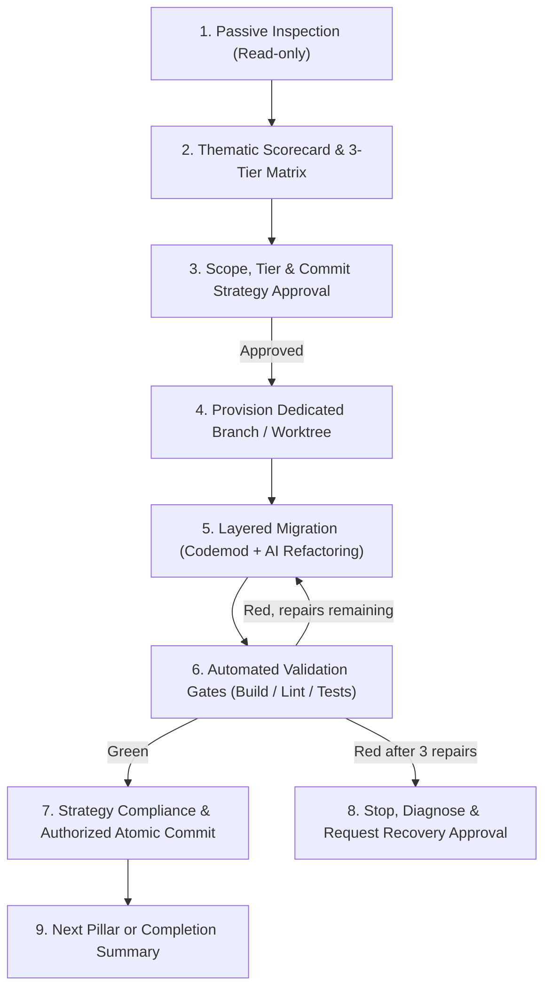

# Repo Modernizer / Acrazie

Audit an existing repository's setup, dependencies, runtimes, and developer tooling. Structure modernization opportunities into 6 thematic pillars and 3 ambition tiers, then guide safe, automated, step-by-step migrations with AI assistance, strict validation gates, and approval-gated rollback safeguards.

---

## Project loading boundary

Published-library defaults remain model-invocable within the requested task. An
explicit project kit or stricter current instruction takes precedence: propose
this skill from available metadata and wait for the user's explicit command before
reading its instructions. Apply the same gate to each dependency before reading
or dispatching its instructions; one invocation does not activate a chain.
Use `$skill-name` in Codex or `/skill-name` in Claude Code. These gates are not
filesystem access controls or proof of live host behavior. Global homonyms may
remain a blocker. Do not read an unactivated skill or delegate its body as a bypass.
Loading grants no migration, installation, spawning, shipping or recovery permission.
Under ordinary library defaults retain scoped implicit handoffs. Conceptual
references to Repo Init's standards are not a mandatory skill dependency and do
not authorize reading or invoking it; this workflow keeps its specialist interview.

## User decision format

For any user-owned choice, display only Current state, numbered Options,
Recommendation and Response. Translate labels/content into the user's language;
do not add question IDs, preselect an answer as consent or treat a recommendation
as approval. Apply this to pillar/tier, plan, installation, governance, Git and
recovery decisions. The scorecard, validation evidence and reports retain their
own structures; do not replace them with the question format.

## 1. Entry and Authorization

Select this skill for requested upgrades or repository modernization. Under published defaults no named skill command is required; the project loading boundary governs explicit kits. Start with relevant read-only discovery, limited to the requested target. Do not turn a bug fix or feature into an opportunistic modernization program. Selection does not approve migration, installation, shipping, or destructive recovery; follow the gates below and applicable repository permissions.

---

## 2. Scope, Invariants & Hard Rules

1. **Brownfield Specialization & Complementarity with `github-repo-init-acrazie` :**
   - `github-repo-init-acrazie` owns new-repository scaffolding and approved engineering activation in existing repositories, preserving their stack. Activating a kit is not a stack migration.
   - `repo-modernizer-acrazie` operates at **Day 2+** (taking an existing repository, auditing its setup, modernizing legacy configurations to target the same modern standards, and offering to backfill missing bricks like CI workflows, Lefthook hooks, and governance files).
2. **Read-Only Inspection First :**
   - The initial scan must be strictly passive and non-destructive. Never modify files, install packages, or mutate git state during the diagnosis phase.
3. **Approval Gate Before Any Mutation :**
   - Present a structured **Modernization Scorecard** and obtain explicit user confirmation on the chosen pillar, tier and plan before migration; reuse independently evidenced current approval as described in Step 3. Branch/worktree creation and installation retain their applicable separate permissions.
4. **Strict Git & Worktree Isolation :**
   - **NEVER** modify or commit files directly on `main` or the active working branch. Always perform migrations within a dedicated branch or worktree using the repository-approved naming and isolation rules. Treat `modernize/<theme>` as an example, not an imposed prefix.
5. **Layered Sequencing :**
   - Plan upgrades by logical layers; group inseparable cross-layer changes into one validated commit rather than producing broken intermediate commits:
     1. Runtime & Package Manager (e.g. Node, pnpm, uv)
     2. Developer Tooling & Quality (Linters, formatters, test runners, git hooks)
     3. Core Framework & Application (React, Next.js, FastAPI, Symfony...)
     4. Secondary & utility dependencies.
6. **Hybrid Refactoring Protocol :**
   - Run official, battle-tested migration tools and codemods first (e.g. `biome migrate`, `vitest-codemod`, `pyupgrade`, `rector process`).
   - Mobilize the AI to surgically translate complex configurations, adapt deprecated API calls, and update mocks/tests.
7. **Automated Validation Gates :**
   - Every modification must pass 4 verification gates: Lockfile integrity, Lint/Format, Typecheck, and Test Suite.
8. **AI Self-Healing & Approval-Gated Rollback :**
   - If tests or build fail, the AI may attempt up to 3 targeted auto-repair iterations.
   - Record the SHA and validation evidence for each verified green checkpoint. If failures persist after 3 attempts, stop, preserve the current state, and provide a blocker diagnostic referencing that checkpoint (or explicitly state that none exists). Never infer that `HEAD` is green. For recovery, obtain separate explicit confirmation before destructive rollback, specifying the affected paths, target revision, and consequences; migration approval is not recovery permission.
9. **Mandatory Approved Commit Strategy & ADR Documentation :**
   - Discover existing Git policy, resolve conflicts, and approve the migration commit plan before execution. Read [references/commit-strategy.md](references/commit-strategy.md). Follow the approved strategy before every commit; block non-compliance instead of silently relaxing it. Conventional Commits are an option, not a universal requirement. Never include co-author attributions (`Co-authored-by:`).
   - Control compliance even without hooks or CI; installing enforcement tools and changing remote settings are separate opt-in actions. Commit, push, and PR permissions remain distinct.
   - Any Tier 2 (Major) or Tier 3 (Modern Replacement) migration must generate its formal Architecture Decision Record under `docs/adr/` before validation and the corresponding commit.

---

## 3. Workflow Overview

---

## 4. Step-by-Step Operating Guide

### Step 1: Passive Environmental Inspection
Read [references/inspection-checklist.md](references/inspection-checklist.md) before inspecting.
1. Check repository root, current git branch, and clean status (`git status --porcelain`).
2. Identify active manifests, lockfiles, and runtimes:
   - Node/JS/TS: `package.json`, lockfile type, `.nvmrc`, `tsconfig.json`.
   - Python: `pyproject.toml`, `requirements.txt`, `poetry.lock`, `uv.lock`.
   - Go / Rust / PHP: `go.mod`, `Cargo.toml`, `composer.json`.
3. Detect existing linters, formatters, bundlers, and test runners (`.eslintrc*`, `biome.json`, `webpack.config.*`, `vite.config.*`, `jest.config.*`, `vitest.config.*`).
4. Inspect CI/CD workflows under `.github/workflows/` and git hooks (`lefthook.yml`, `.husky/`). Inspect Git governance, recent commit messages, release constraints, and accessible remote protections as detailed in [references/commit-strategy.md](references/commit-strategy.md); distinguish inaccessible rules from absent rules.
5. Check for missing governance or DX assets compared to `github-repo-init-acrazie` standards.

---

### Step 2: Thematic Scorecard & 3-Tier Matrix
Read [references/taxonomy-matrix.md](references/taxonomy-matrix.md) and [references/modernization-catalog.md](references/modernization-catalog.md).
Structure findings across the 6 thematic pillars and present a compact Markdown table:

| Pilier | Outil Actuel | Statut / Version | Recommandation Tier 1 (Drop-in) | Recommandation Tier 2 (Majeur) | Recommandation Tier 3 (Remplacement Moderne) | Effort / Gain |
| :--- | :--- | :--- | :--- | :--- | :--- | :--- |
| **Runtime** | Node 18 | EOL proche | Node 20 LTS | Node 22 Current | - | Faible / Fiabilité |
| **Qualité & Lint** | ESLint legacy + Prettier | Format .eslintrc déprécié | Bump patch | ESLint 9 Flat Config | **Biome** (vitesse x25, zéro config) | Moyen / DX x10 |
| **Build & Bundler** | Webpack 4 / CRA | Build lent (>45s) | Bump Webpack 5 | - | **Vite** (HMR instantané, TS natif) | Modéré / Gain maximal |
| **Tests & QA** | Jest (`ts-jest`) | ESM complexe, lent | Jest 29 + SWC | - | **Vitest** (partage config Vite, x5 rapide) | Modéré / Vitesse |
| **CI/CD & DevOps** | GH Actions v2/v3, sans hooks | Actions dépréciées | Bump actions@v4 | - | **Lefthook** + **Release Please** | Faible / Automatisation |
| **Dépendances** | npm standard | Dépendances obsolètes | `npm update` (patch/minor) | Upgrades majeures ciblées | Migration vers **pnpm** ou **uv** | Modéré / Espace disque |

Highlight any **missing essential blocks** (e.g. no git hooks installed, no automated release pipeline, missing security policy).

---

### Step 3: Interactive Selection & Approval Gate
Reuse an explicitly approved migration plan when pillar, tier, scope, exclusions,
commit strategy and required validations remain applicable, with approval evidence
beyond a status label. Revalidate repository facts and required checks; an approved
plan is not evidence of a green checkpoint. Do not repeat settled choices or
require Interview/Git Ship to recreate this specialist's plan. If new evidence
invalidates it, reopen only affected decisions before the dependent execution.
Plan reuse does not grant loading, installation, staging/commit/push/PR or
destructive recovery permissions; evaluate those independently at their boundaries.

Ask the user only unresolved pillar and ambition-tier choices.
If the user provided explicit scope upfront (e.g. `$repo-modernizer-acrazie --theme testing`), confirm the plan for that pillar.
Include the approved commit strategy and proposed commit boundaries in that plan. Preserve existing policy; ask only unresolved choices. If policy is missing, propose `docs/git-workflow.md` and obtain approval before creating it, keeping existing `AGENTS.md` and `CONTRIBUTING.md` consistent without overwriting them. Hooks, dependencies, and GitHub settings require separate choices.
Do **NOT** proceed to file modifications without independently evidenced explicit approval covering the current target plan and realization, including its commit strategy. An unresolved policy conflict blocks the affected execution.

---

### Step 4: Provision Dedicated Branch or Worktree
Read [references/execution-protocol.md](references/execution-protocol.md).
1. Verify the repository root, branch, index, and working-tree state. Preserve unrelated changes; never stash, commit, or discard them implicitly.
2. Provision the approved isolated branch/worktree according to repository policy, using the chosen base, branch name, and path. Respect required worktrees and forbidden branches. If the remote base cannot be refreshed, stop and ask before offline execution; never silently fall back to a stale base.
3. Run the agreed baseline validations and record the SHA with their results as the initial checkpoint only if they pass. If no verified checkpoint exists, report that fact and arbitrate before migration.

---

### Step 5: Execute Migration (Codemods + AI Refactoring)
Follow the layered ordering from [references/execution-protocol.md](references/execution-protocol.md):
1. **Run official codemods / migration CLI first** (e.g. `pnpm biome migrate eslint --write`, `npx vitest-codemod`, `uv init --bare`, `rector process`).
2. **Translate configuration files** (e.g. `vite.config.ts`, `biome.json`, `lefthook.yml`).
3. **Remove obsolete dependencies and configs** from package manifests.
4. **Refactor codebase call sites** via targeted AI edits (updating deprecated imports, mocks, and type annotations).
5. Prepare required ADRs and governance changes within the same coherent unit before validation. Follow approved commit boundaries, not an automatic one-commit-per-tool rule.

---

### Step 6: Automated Validation Gates & Self-Healing
Use the actual repository commands for the 4 validation gates in order; the commands below are examples, not tool installation instructions. Missing, unavailable, or failing required checks block the commit. A genuinely inapplicable gate needs an explicit reason in the approved plan, never an invented success:
1. `Lockfile & Install` : `pnpm install --frozen-lockfile` / `uv sync`
2. `Linter & Formatter` : `pnpm biome check .` / `uv run ruff check`
3. `Typecheck` : `pnpm tsc --noEmit` / `cargo check`
4. `Test Suite` : `pnpm test` / `uv run pytest`

**Self-Healing Loop :**
- If an error occurs, analyze the stack trace and apply targeted patches.
- Maximum 3 self-repair attempts allowed.
- If the suite is not 100% green after 3 attempts:
  - Stop, preserve the current state, and present a **Blocker Diagnostic Report** with the failing command, evidence, repair count, and recorded verified checkpoint SHA (or its absence).
  - Inspect and preserve unrelated changes; show exact affected paths and target revision. Obtain separate explicit confirmation before any destructive reset or cleanup. If declined, preserve the current state and await arbitration.

---

### Step 7: Commit, ADR Documentation & Completion
1. Follow [references/commit-strategy.md](references/commit-strategy.md): verify authorization, exact staged scope, coherent boundaries, the selected message convention, and validation evidence for the staged snapshot. Include required ADRs prepared in Step 5. Any failed or unresolved check blocks the commit; do not bypass hooks or weaken policy.
2. Commit only if authorized by applicable user/repository rules; otherwise present the reviewed scope, proposed message, and proof and request approval. Approval of migration or policy alone grants no shipping authority.
3. After a successful commit, record its SHA with validation evidence as a checkpoint. If hooks changed files, recheck scope and validation before marking that revision green.
4. Summarize achieved migration units, compliance, checkpoint SHAs, and actual checks. Apply push and PR permissions separately; do not infer them from commit permission. Distinguish local validation, pending CI, PR state, and deployment. Offer the next pillar or PR only within the authorized scope.
