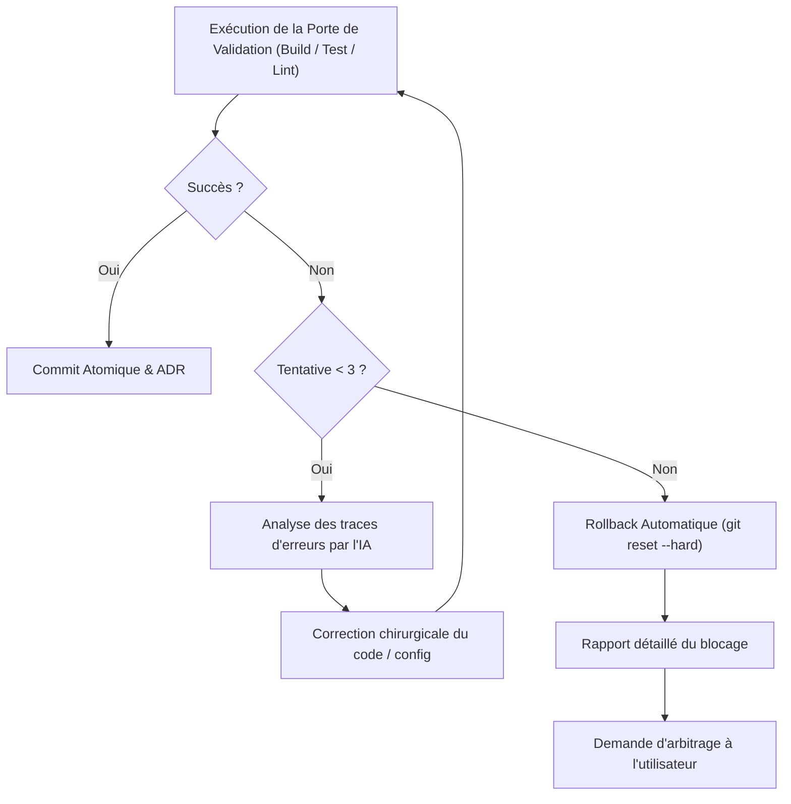

# Protocole d'Exécution, Validation & Rollback

Ce document détaille les règles opérationnelles strictes que le skill `repo-modernizer-acrazie` applique lors de la phase de modification du code et des configurations.

---

## 1. Règle d'Or : Isolation Git Obligatoire

Ne **JAMAIS** appliquer de modifications directement sur la branche principale (`main` ou `master`).

1. **Vérification de l'état Git :**
   Avant toute action, vérifier que le dépôt est propre (`git status --porcelain`). Si des modifications non commitées existent, demander à l'utilisateur de les stasher ou de les commiter.
2. **Création d'une branche dédiée ou d'un worktree :**
   - Nommage de la branche : `modernize/<theme>` (ex: `modernize/testing-vitest`, `modernize/linter-biome`, `modernize/runtime-node22`).
   - Si les worktrees sont utilisés dans le dépôt :
     ```bash
     git worktree add .worktrees/modernize-<theme> -b modernize/<theme>
     cd .worktrees/modernize-<theme>
     ```
   - Sinon, sur branche dédiée standard :
     ```bash
     git checkout -b modernize/<theme>
     ```

---

## 2. Ordonnancement par Couches Logiques

Pour éviter les conflits de dépendances croisées (dependency hell) et les régressions en cascade, les modifications doivent être séquencées par couches strictes :

```text
  ┌───────────────────────────────────────────────────────────┐
  │ COUCHE 1 : Runtime & Gestionnaire de Paquets              │
  │ (.nvmrc, .python-version, passage à pnpm / uv)            │
  └─────────────────────────────┬─────────────────────────────┘
                                │ (Valider build & install)
  ┌─────────────────────────────▼─────────────────────────────┐
  │ COUCHE 2 : Outillage de Développement & Qualité           │
  │ (Linters, formatters, test runners, git hooks)            │
  └─────────────────────────────┬─────────────────────────────┘
                                │ (Valider lint & tests)
  ┌─────────────────────────────▼─────────────────────────────┐
  │ COUCHE 3 : Cœur Applicatif & Frameworks Majeurs           │
  │ (React 19, Next.js App Router, FastAPI, Symfony, etc.)    │
  └─────────────────────────────┬─────────────────────────────┘
                                │ (Valider tests unitaires)
  ┌─────────────────────────────▼─────────────────────────────┐
  │ COUCHE 4 : Dépendances Utilitaires Secondaires            │
  │ (Bibliothèques auxiliaires, plugins, helpers)             │
  └───────────────────────────────────────────────────────────┘
```

Chaque couche doit être totalement validée et commitée de manière atomique avant de passer à la couche suivante.

---

## 3. Approche Hybride de Refactorisation

Lors d'une montée majeure (Tier 2) ou d'un remplacement d'outil (Tier 3), la refactorisation suit une démarche en 3 temps :

1. **Étape A : Exécution des outils et codemods officiels**
   - Lorsqu'un outil officiel existe (ex: `biome migrate`, `vitest-codemod`, `rector process`, `cargo fix`), le lancer en priorité pour transformer la masse du code de manière déterministe.
2. **Étape B : Traduction chirurgicale des configurations par l'IA**
   - L'IA traduit les fichiers de configuration spécifiques (ex: adaptation fine de `vite.config.ts`, `tsconfig.json`, `lefthook.yml`).
   - Nettoyage des anciennes dépendances devenues obsolètes dans le manifest (`package.json`, `pyproject.toml`, etc.).
3. **Étape C : Résolution ciblée des régressions et adaptation du code**
   - Correction manuelle/ciblée des imports dépréciés, des mocks non migrés et des typages stricts.

---

## 4. Portes de Validation Automatisées (Validation Gates)

Chaque palier de migration doit franchir avec succès 4 portes de validation consécutives :

| Porte | Intitulé | Commandes Types | Critère de Succès |
| :--- | :--- | :--- | :--- |
| **Gate 1** | **Installation & Lockfile** | `pnpm install --frozen-lockfile` / `uv sync` | Code retour 0, pas d'erreurs de résolution |
| **Gate 2** | **Formatage & Linting** | `pnpm biome check .` / `uv run ruff check` | Code retour 0, zéro violation bloquante |
| **Gate 3** | **Vérification de Types** | `pnpm tsc --noEmit` / `cargo check` | Code retour 0, zéro erreur de typage |
| **Gate 4** | **Suite de Tests** | `pnpm test` / `uv run pytest` | 100% des tests existants passent au vert |

---

## 5. Boucle d'Auto-Correction IA & Rollback Automatique

Si l'une des portes de validation échoue :



### Mécanisme de Rollback :
- Si après **3 tentatives d'auto-réparation**, la suite de tests ou le build ne passe toujours pas :
  1. Le skill exécute un `git reset --hard` vers le dernier commit stable vérifié.
  2. Le skill nettoie les fichiers temporaires non commités (`git clean -fd`).
  3. Le skill génère un **Rapport de Blocage Technique** indiquant :
     - La commande exacte ayant échoué et la trace d'erreur représentative.
     - L'incompatibilité sous-jacente identifiée (ex: dépendance tierce n'offrant pas encore de support ESM).
     - Les options possibles pour l'utilisateur (ex: isoler la dépendance bloquante, reporter ce chantier, ou accepter un compromis).

---

## 6. Commits Atomiques & Documentation ADR

1. **Conventional Commits :**
   - Chaque couche ou outil modernisé fait l'objet d'un commit unique :
     - `build(deps): update runtime to node 22`
     - `chore(tooling): migrate eslint and prettier to biome`
     - `test(runner): migrate unit tests from jest to vitest`
   - Ne jamais inclure de mentions de co-auteur (`Co-authored-by:`).
2. **Génération d'ADR :**
   - Pour toute décision de Tier 2 (changement majeur) ou Tier 3 (remplacement d'outil), créer un fichier sous `docs/adr/YYYY-MM-DD-<titre>.md` à partir de [references/adr-template.md](references/adr-template.md).
