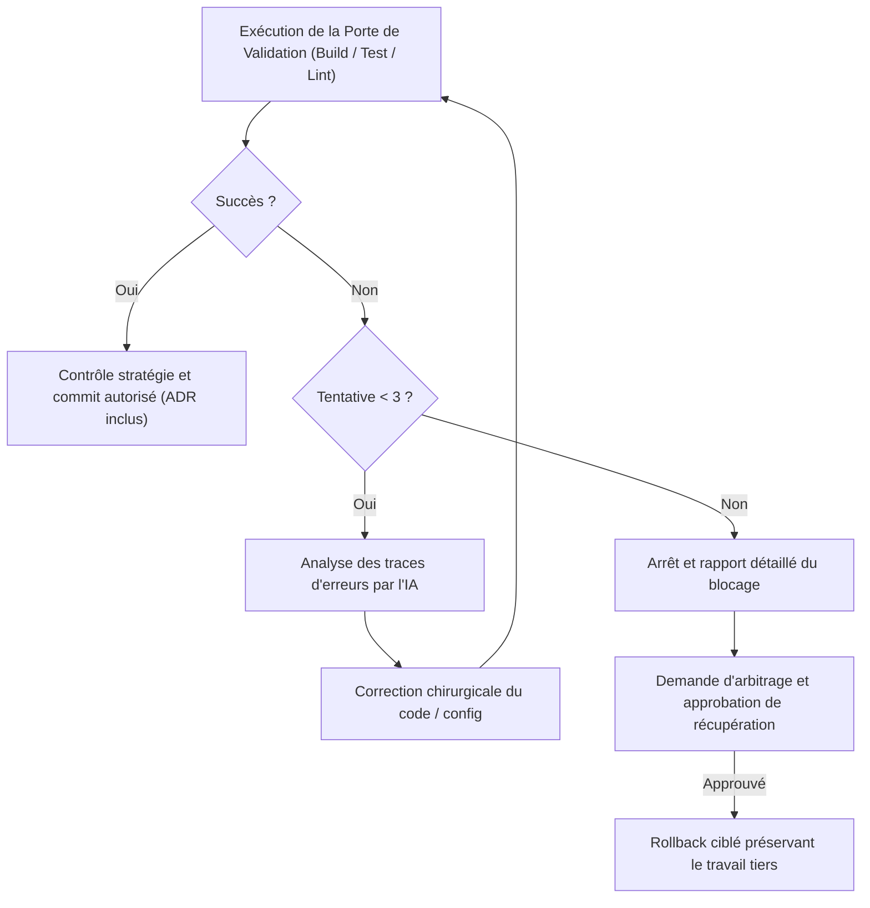

# Protocole d'Exécution, Validation & Rollback

Ce document détaille les règles opérationnelles strictes que le skill `repo-modernizer-acrazie` applique lors de la phase de modification du code et des configurations.

---

## 1. Règle d'Or : Isolation Git Obligatoire

Ne **JAMAIS** appliquer de modifications directement sur la branche principale (`main` ou `master`).

1. **Vérification de l'état Git :**
   Avant toute action, inspecter branche, index, fichiers modifiés et non suivis (`git status --porcelain`). Préserver le travail tiers ; ne jamais le stasher, commiter, désindexer ou supprimer implicitement. Isoler la migration conformément à la politique du dépôt ; demander arbitrage si cette isolation est impossible.
2. **Création d'une branche dédiée ou d'un worktree :**
   - Appliquer le nom, la base et le chemin approuvés selon la politique du dépôt. `modernize/<theme>` n'est qu'un exemple ; respecter les préfixes imposés et les worktrees obligatoires.
   - Vérifier la fraîcheur de la base distante choisie avant création. Si cette vérification échoue, demander accord pour un travail hors ligne ; ne jamais utiliser silencieusement une base obsolète.
3. **Stratégie et état initial :**
   - Approuver la stratégie et le plan de commits selon [commit-strategy.md](commit-strategy.md) avant migration.
   - Exécuter les validations de référence et enregistrer le SHA avec leurs résultats uniquement si elles réussissent. Sans point de contrôle vérifié, signaler son absence et demander arbitrage avant migration.

---

## 2. Ordonnancement par Couches Logiques

Pour éviter les conflits de dépendances croisées (dependency hell) et les régressions en cascade, planifier les modifications par couches logiques :

```text
  ┌───────────────────────────────────────────────────────────┐
  │ COUCHE 1 : Runtime & Gestionnaire de Paquets              │
  │ (.nvmrc, .python-version, passage à pnpm / uv)            │
  └─────────────────────────────┬─────────────────────────────┘
                                │ (Valider build & install)
  ┌─────────────────────────────▼─────────────────────────────┐
  │ COUCHE 2 : Outillage de Développement & Qualité           │
  │ (Linters, formatters, test runners, git hooks)            │
  └─────────────────────────────┬─────────────────────────────┘
                                │ (Valider lint & tests)
  ┌─────────────────────────────▼─────────────────────────────┐
  │ COUCHE 3 : Cœur Applicatif & Frameworks Majeurs           │
  │ (React 19, Next.js App Router, FastAPI, Symfony, etc.)    │
  └─────────────────────────────┬─────────────────────────────┘
                                │ (Valider tests unitaires)
  ┌─────────────────────────────▼─────────────────────────────┐
  │ COUCHE 4 : Dépendances Utilitaires Secondaires            │
  │ (Bibliothèques auxiliaires, plugins, helpers)             │
  └───────────────────────────────────────────────────────────┘
```

Valider chaque unité cohérente avant commit et avant une unité indépendante suivante. Si plusieurs outils ou couches sont indissociables pour obtenir un état valide, les regrouper dans une unité approuvée. Ne pas créer de commits intermédiaires cassés pour respecter artificiellement une frontière de couche.

---

## 3. Approche Hybride de Refactorisation

Lors d'une montée majeure (Tier 2) ou d'un remplacement d'outil (Tier 3), la refactorisation suit une démarche en 3 temps :

1. **Étape A : Exécution des outils et codemods officiels**
   - Lorsqu'un outil officiel existe (ex: `biome migrate`, `vitest-codemod`, `rector process`, `cargo fix`), le lancer en priorité pour transformer la masse du code de manière déterministe.
2. **Étape B : Traduction chirurgicale des configurations par l'IA**
   - L'IA traduit les fichiers de configuration spécifiques (ex: adaptation fine de `vite.config.ts`, `tsconfig.json`, `lefthook.yml`).
   - Nettoyage des anciennes dépendances devenues obsolètes dans le manifest (`package.json`, `pyproject.toml`, etc.).
3. **Étape C : Résolution ciblée des régressions et adaptation du code**
   - Correction manuelle/ciblée des imports dépréciés, des mocks non migrés et des typages stricts.

---

## 4. Portes de Validation Automatisées (Validation Gates)

Chaque unité de migration doit franchir les 4 portes de validation applicables avec les commandes réelles du dépôt. Les exemples ci-dessous n'autorisent aucune installation. Une porte véritablement inapplicable nécessite une justification approuvée dans le plan ; une vérification requise absente, indisponible ou en échec bloque le commit.

| Porte | Intitulé | Commandes Types | Critère de Succès |
| :--- | :--- | :--- | :--- |
| **Gate 1** | **Installation & Lockfile** | `pnpm install --frozen-lockfile` / `uv sync` | Code retour 0, pas d'erreurs de résolution |
| **Gate 2** | **Formatage & Linting** | `pnpm biome check .` / `uv run ruff check` | Code retour 0, zéro violation bloquante |
| **Gate 3** | **Vérification de Types** | `pnpm tsc --noEmit` / `cargo check` | Code retour 0, zéro erreur de typage |
| **Gate 4** | **Suite de Tests** | `pnpm test` / `uv run pytest` | 100% des tests existants passent au vert |

---

## 5. Boucle d'Auto-Correction IA & Rollback Approuvé

Si l'une des portes de validation échoue :


```mermaid
flowchart TD
    RunGate["Exécution de la Porte de Validation (Build / Test / Lint)"] --> Check{"Succès ?"}
    Check -- Oui --> Commit["Contrôle stratégie et commit autorisé (ADR inclus)"]
    Check -- Non --> Loop{"Tentative < 3 ?"}
    Loop -- Oui --> Analyze["Analyse des traces d'erreurs par l'IA"]
    Analyze --> Patch["Correction chirurgicale du code / config"]
    Patch --> RunGate
    Loop -- Non --> Report["Arrêt et rapport détaillé du blocage"]
    Report --> Arbitrate["Demande d'arbitrage et approbation de récupération"]
    Arbitrate -- Approuvé --> Rollback["Rollback ciblé préservant le travail tiers"]
```

### Mécanisme de Rollback :
- Si après **3 tentatives d'auto-réparation**, la suite de tests ou le build ne passe toujours pas :
  1. Le skill s'arrête et préserve l'état courant. Il inspecte les modifications et fichiers non suivis, distingue son travail du travail tiers et cite le SHA du dernier point de contrôle enregistré avec ses preuves de validation. `HEAD` seul ne prouve pas un état vert ; sans point de contrôle enregistré, signaler son absence et ne pas inventer de cible de récupération.
  2. Il présente les chemins concernés, la révision cible et les conséquences de la récupération proposée. Toute action destructive (`git reset --hard`, `git clean -fd`) exige une confirmation explicite distincte ; l'approbation de migration ne suffit pas. Sans confirmation, aucun reset ni nettoyage destructif n'est exécuté.
  3. Le skill génère un **Rapport de Blocage Technique** indiquant :
     - La commande exacte ayant échoué et la trace d'erreur représentative.
     - L'incompatibilité sous-jacente identifiée (ex: dépendance tierce n'offrant pas encore de support ESM).
     - Les options possibles pour l'utilisateur (ex: isoler la dépendance bloquante, reporter ce chantier, ou accepter un compromis).

---

## 6. Stratégie de Commit Obligatoire & Documentation ADR

Appliquer [commit-strategy.md](commit-strategy.md) avant chaque commit : autorisation, périmètre exact de l'index, cohérence, format du message et preuves de validation. Toute non-conformité bloque le commit, même en l'absence de hooks ou CI. Aucun contournement silencieux n'est permis.

Pour Tier 2 ou Tier 3, préparer l'ADR selon [adr-template.md](adr-template.md) avant les validations et l'inclure dans le commit de migration concerné. Vérifier également les fichiers de gouvernance et d'automatisation approuvés.

Après chaque commit réussi, enregistrer son SHA et les résultats des validations comme point de contrôle ; si un hook a modifié le contenu, recontrôler périmètre et validations avant d'enregistrer un état vert. Respecter séparément les permissions de staging, commit, push et PR. Ne jamais ajouter de mention `Co-authored-by:`.
