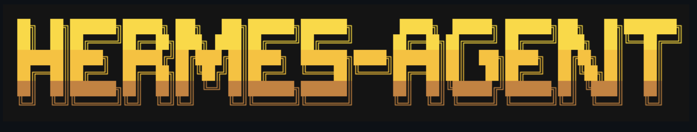
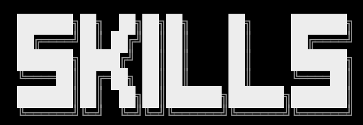

# Acrazie retro-tech wordmark language

Use this reference only when the user explicitly asks for the Acrazie skill-logo language demonstrated here. It is visual vocabulary, not a default for unrelated icon work and not permission to trace the supplied marks.

## Supplied references

### HERMES-AGENT



### SKILLS



Extract shared principles and create new lettering topology. Do not reproduce, trace, or merely recolor either reference.

## Shared design principles

- wide, heavy, grid-built capitals with predominantly orthogonal geometry
- modular silhouettes assembled from repeated rectangular units
- offset echo layers that create depth without illustrative shading
- high contrast against transparent, light, or dark surroundings
- controlled cuts, discontinuities, and asymmetry that prevent a generic bitmap-font result
- compact rectangular composition with deliberate alignment between lines
- legibility carried by the primary silhouette; echo layers remain secondary

## Approved palette

Preserve these identifiers and source values when the user requests this palette:

```css
--pumpkin-spice: #ff6d00ff;
--harvest-orange: #ff7900ff;
--princeton-orange: #ff8500ff;
--deep-saffron: #ff9100ff;
--amber-glow: #ff9e00ff;
--dark-amethyst: #240046ff;
--indigo-ink: #3c096cff;
--indigo-velvet: #5a189aff;
--royal-violet: #7b2cbfff;
--lavender-purple: #9d4eddff;
```

For the approved vertical treatment, apply the stops from top to bottom in exactly that order. Eight-digit values ending in `ff` may be serialized as equivalent opaque six-digit SVG colors.

## SVG Icon Designer application

The approved mark uses:

- `SVG-ICON` on the upper half and `DESIGNER` on the lower half
- two eight-character lines forming one compact rectangular wordmark
- original geometric lettering rather than an installed font
- three southeast echo layers behind the primary face
- a transparent background
- the full vertical orange-to-violet gradient across the shared composition

Canonical source: `assets/svg-icon-designer-logo.svg`.

Validate the mark after any change at full size and at widths of 300 px and 150 px. Confirm exact text, visible but subordinate echoes, balanced clear space, and no clipping.
